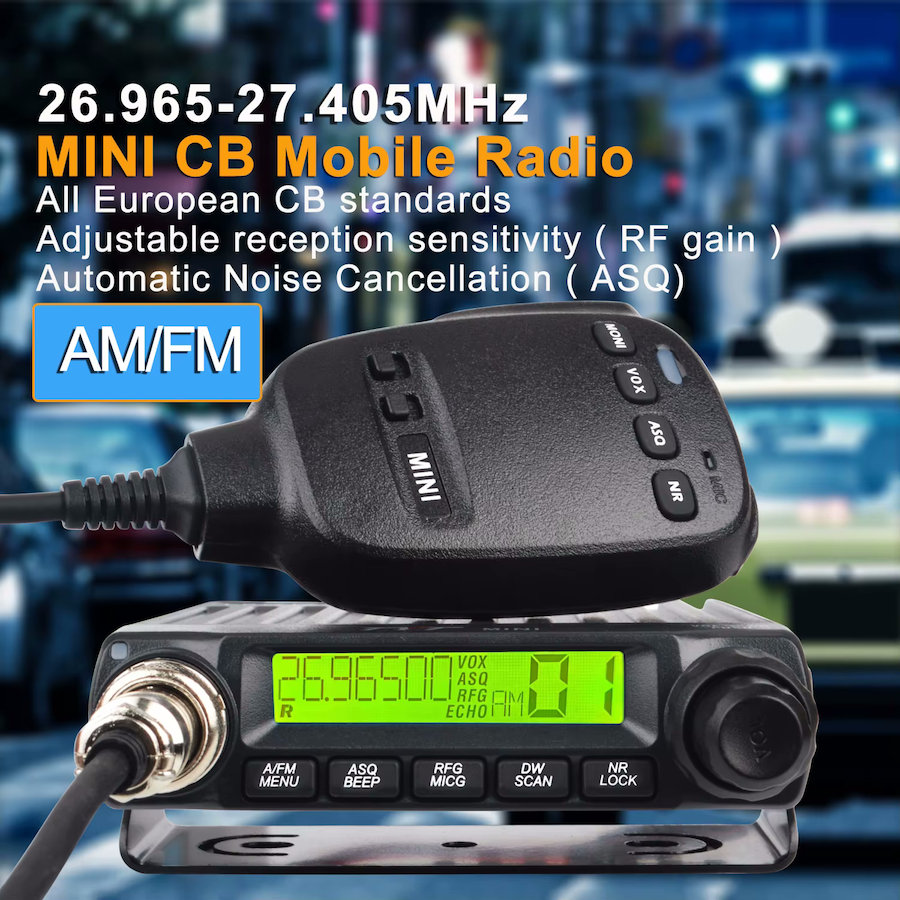

# Introduction
I bought this radio earlier this year so I could start transmitting on the CB band again. After a while, I wanted to connect a sound card modem to test packet radio.
To do that, I needed the microphone wiring diagram, but I couldn’t find it anywhere online. I also sent an email to TYT directly in the hope of finding out more.

In the meantime, I did some research on my own, and you can find it here.

# Inside

# This is what you were looking for
| Pin | Function | Remarks | Wire Color
| --- | -------- | ------- | ---------- |
| 1 | Modulation | +2.6V phantom power | YELLOW |
| 2 | Data (UP, DOWN, NR, ...) | +3.3V | BLUE |
| 3 | TX | +3.3V | WHITE |
| 4 | Not Used | | |
| 5 | GND | | BLACK |
| 6 | +5V | For MCU | RED |

# DATA Protocol
The data line is +3.3V high, when pressing a button, for example UP or DOWN, the voltage drops slightly to quickly go to its nominal voltage.
This leads me to believe it is some data train from the MCU to the radio.

Maybe some day...

# Other mod
The volume is controlled by a rotary encoder, even on the lowest setting, it is too loud.
I opened the radio and soldered a resistor inline with the speaker. Value was about 50 Ohm.

Still loud, but better to control now. The internal speaker however quickly get's distorted.

